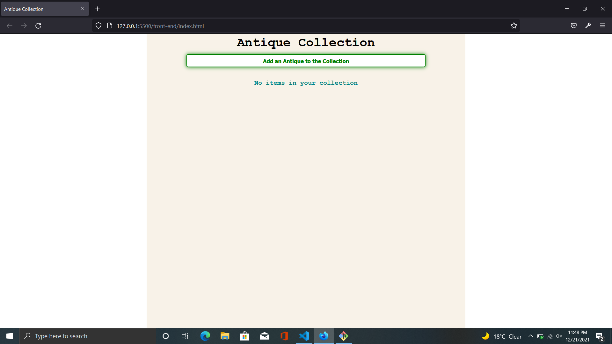
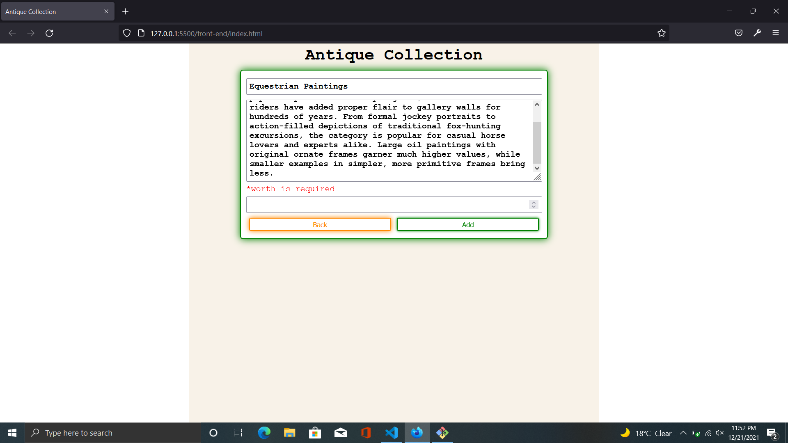
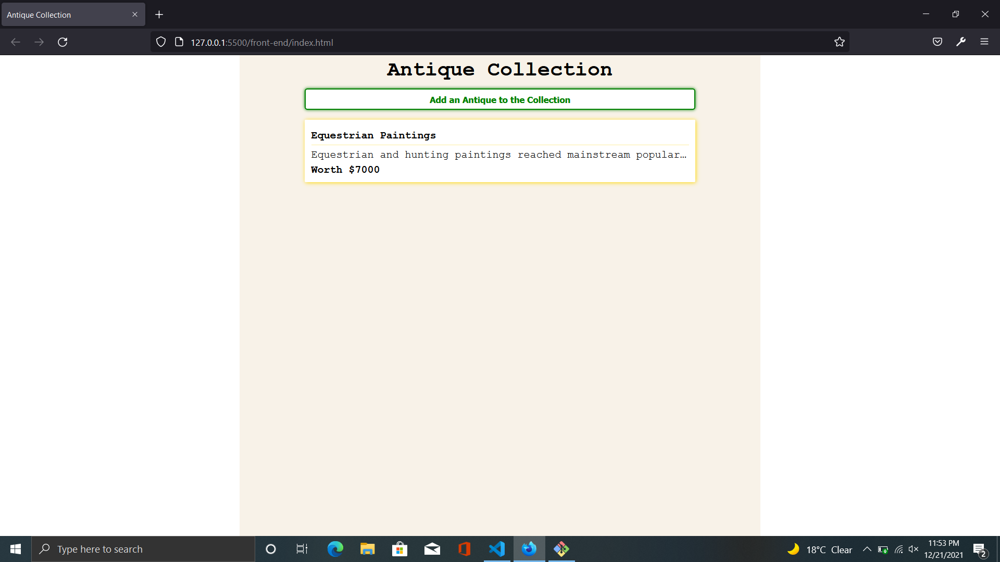
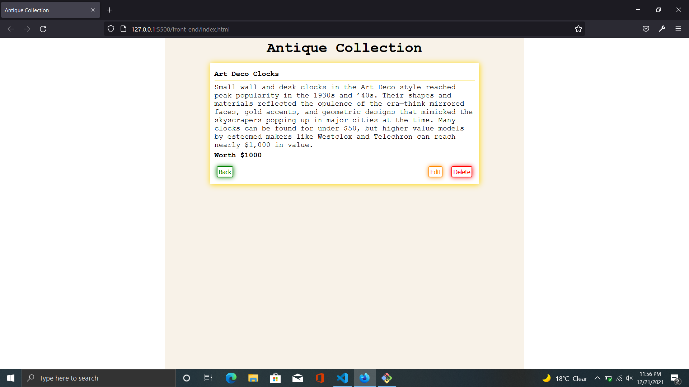
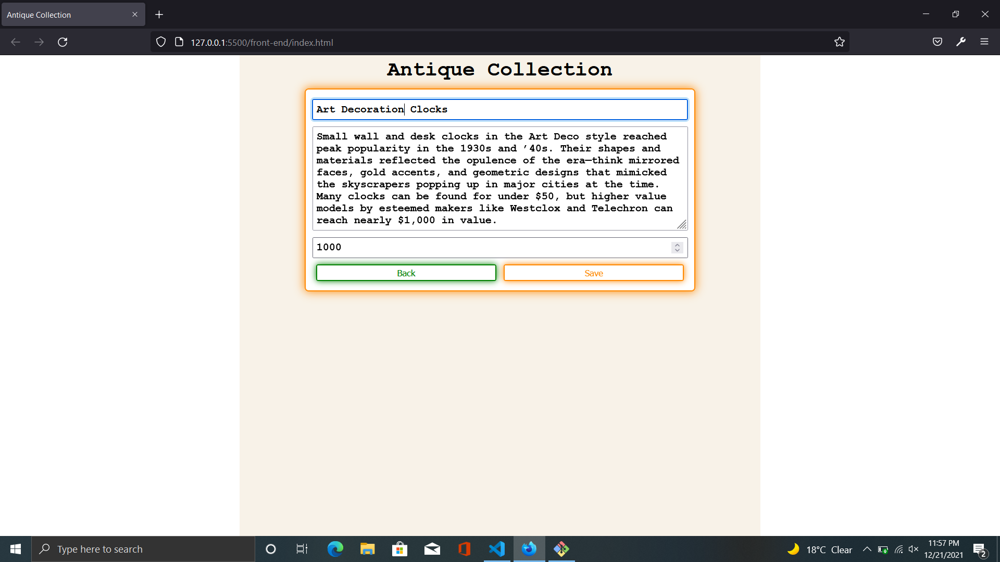
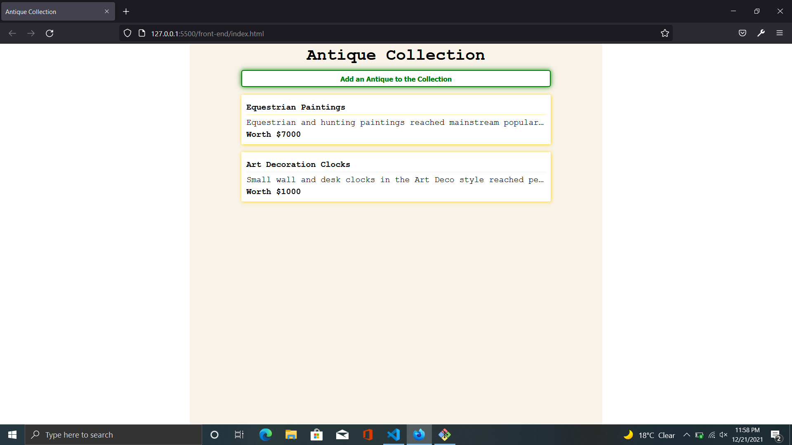
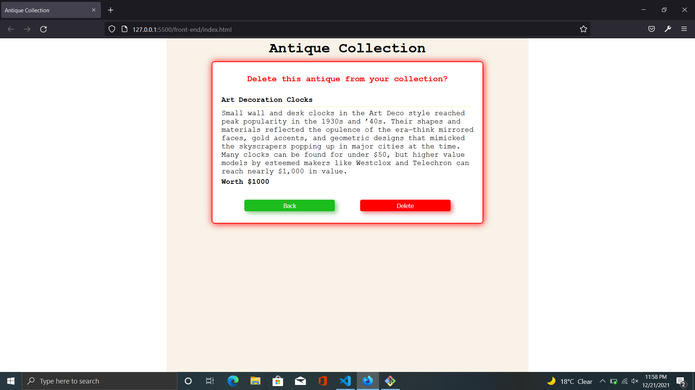
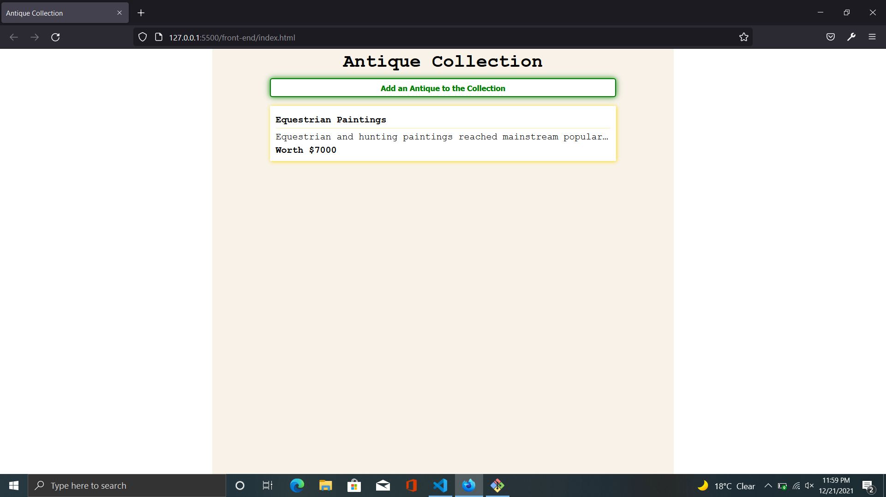

# **Antique Collection**

## description
- Collection of antique collectors
- Create, Read, Update, Delete functionality
    - Add antique item to colletion 
    - Read antique details
    - Update existing antique details
    - Delete existing antique item
- Feel good user interface

## Setup
Clone the repository and navigate to root directory (*antique-collection*)

### backend-setup

- Navigate to back-end directory

  `cd back-end`

- Install all dependencies

  `yarn`

- Setup sqlite database using prisma to create models

  `npx prisma init --datasource-provider sqlite`

  This command generates prisma directory and .env file.

- Add the following code in the end of prisma/schema.prisma file, without affecting the default code generated by prisma

  ```
  model Antique{
    id Int @default(autoincrement()) @id
    name String
    description String
    worth Int
  }
  ```

- Run prisma generate to generate the Prisma Client. You can then start querying your database.

  `npx prisma generate`

- Create actual data database tables by migrating the models

  `npx prisma migrate dev --name initialize_db`
  
  This command generates the dev.db, migrations directory in prisma directory.
  
   `--name` is a parameter for reference. It generates the migrations.sql file in directory which ends with initialize_db.

- Add `PORT=3000` in .env file(*no spaces in between*)

- Run the server using the following command

  `yarn dev`


### frontend-setup

- open new terminal and navigate to front-end directory
  
  `cd front-end`

- run the command to transpile the typescript code into javascript code
  
  `tsc`

- open frontend/index.html using liveserver(preferably in VSCode) and start your antique collection.

## Sample Outputs

Initially there are no antique items in database



Add an antique item by clicking on green button and filling the form (*all form fields are required*)



It will add an antique and redirect to initial page 



If we click on the antique item, antique detail will be displayed.It have three buttons, **back** button used to  navigate back to all antique list. **edit** button is used to  navigate to edit antique page and **delete** button is used to delete antique item. 



Edit page 



After editing the antique data, the data in database will be modified.



If we click on delete button in detail page, it will ask for confirmation.



after clicking confirm delete antique item will be deleted from database confirm delete.

